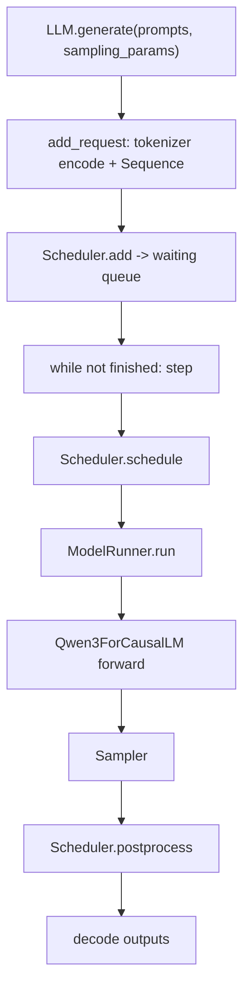

# Nano-vLLM 四周学习规划

## 配置环境
```
OS            Ubuntu
GPU           RTX 3090 ×2
Driver        570.144
CUDA Driver   12.8
nvcc          12.0
Python        3.10.20
PyTorch       2.6.0+cu124
FlashAttention 2.7.4.post1
Triton        3.x
Transformers  ≥4.51
nano-vLLM     ✅ 可运行
```

本文档面向已经具备 Python、PyTorch、Transformer 基础，并希望系统掌握 AI Infra 推理引擎实现的人。目标不是只会运行 `example.py`，而是能从零解释并复现一个轻量 vLLM：模型结构、权重加载、KV cache、continuous batching、prefix caching、FlashAttention、tensor parallel、CUDA Graph 以及推理服务扩展方向。

项目代码规模较小，适合按照“先跑通、再拆解、再复现、再扩展”的路线学习。

## 总体目标

四周结束后，你应该能够：

- 画出 `LLM.generate()` 到模型执行、采样、调度回写的完整链路。
- 独立解释 `Sequence`、`Scheduler`、`BlockManager`、`ModelRunner` 的职责边界。
- 理解 prefill/decode 两阶段在输入组织、attention kernel、KV cache 访问上的差异。
- 理解 Qwen3 模型在 nano-vLLM 中的张量并行切分方式。
- 手写一个最小版本的离线推理引擎，并逐步加入 batching、paged KV cache、prefix cache。
- 能定位吞吐、显存、延迟相关瓶颈，并设计可落地的扩展功能。

## 项目代码地图

核心入口：

- `nanovllm/llm.py`：对外暴露 `LLM`，实际继承 `LLMEngine`。
- `nanovllm/engine/llm_engine.py`：用户 API、tokenizer、请求添加、调度循环、多进程 tensor parallel 生命周期。
- `example.py`：基础离线推理示例。
- `bench.py`：吞吐 benchmark 示例。

调度与 KV cache：

- `nanovllm/engine/sequence.py`：请求状态、token 列表、block table、序列序列化。
- `nanovllm/engine/scheduler.py`：waiting/running 队列、prefill/decode 调度、抢占、后处理。
- `nanovllm/engine/block_manager.py`：KV block 分配、释放、引用计数、prefix cache hash。
- `nanovllm/engine/model_runner.py`：准备输入张量、模型执行、采样、KV cache 分配、CUDA Graph 捕获、tensor parallel 进程通信。

模型与算子：

- `nanovllm/models/qwen3.py`：Qwen3 decoder-only 模型结构。
- `nanovllm/layers/attention.py`：FlashAttention、KV cache 写入 Triton kernel、prefill/decode attention。
- `nanovllm/layers/linear.py`：Column/Row/QKV/Merged tensor parallel linear。
- `nanovllm/layers/embed_head.py`：词表并行 embedding 和 lm head。
- `nanovllm/layers/rotary_embedding.py`：RoPE。
- `nanovllm/layers/layernorm.py`：RMSNorm。
- `nanovllm/layers/sampler.py`：temperature sampling。
- `nanovllm/utils/loader.py`：safetensors 权重加载与 packed weight 映射。
- `nanovllm/utils/context.py`：用全局上下文把调度侧元数据传给 attention/lm head。

## 推荐学习节奏

每周 5 天，每天 2 到 4 小时。周末用于整理笔记、补实验、读 vLLM 对应设计。

每一天都建议产出三类材料：

- 一页源码笔记：关键类、关键字段、关键不变量。
- 一个可运行实验：脚本、单元测试或 notebook 均可。
- 一个复现小模块：哪怕先不支持 GPU，也要把核心数据结构实现出来。

## 第 1 周：跑通项目与建立推理引擎全局图

本周目标：能运行项目，理解离线生成主流程，并把 nano-vLLM 和标准 Transformer 推理过程对齐。

### Day 1：环境、模型与最小运行

代码入口：

- `README.md`
- `example.py`
- `pyproject.toml`
- `nanovllm/config.py`

需要学习：

- PyTorch CUDA 环境、`flash-attn`、`triton` 安装约束。
- Hugging Face `AutoConfig`、`AutoTokenizer`、safetensors 模型文件。
- Qwen3 chat template 和 tokenizer 输出。
- `Config` 中的关键参数：`max_num_batched_tokens`、`max_num_seqs`、`max_model_len`、`gpu_memory_utilization`、`tensor_parallel_size`、`kvcache_block_size`。

动手任务：

1. 下载 `Qwen/Qwen3-0.6B` 到 `~/huggingface/Qwen3-0.6B/`。
2. 跑通 `example.py`，记录首 token 前等待、总生成时间、GPU 显存占用。
3. 修改 `SamplingParams(max_tokens, temperature, ignore_eos)`，观察输出差异。
4. 将 `enforce_eager=True/False` 分别运行，记录是否成功以及速度差异。

预期效果：

- 能解释 `LLM(path, enforce_eager=True, tensor_parallel_size=1)` 初始化时发生了什么。
- 能说清楚 `Config.__post_init__()` 为什么需要读取 HF config，以及为什么限制 `max_model_len`。

### Day 2：从 `generate()` 追踪完整调用链

代码入口：

- `nanovllm/llm.py`
- `nanovllm/engine/llm_engine.py`
- `nanovllm/sampling_params.py`

需要学习：

- 离线 batch generate 的基本循环。
- request 添加、调度、模型执行、后处理之间的控制流。
- prefill throughput 与 decode throughput 的含义。
- Python dataclass、`slots=True`、`multiprocessing.spawn`。

动手任务：

1. 给 `LLMEngine.add_request()`、`step()`、`generate()` 加临时日志，打印 seq id、prompt 长度、每轮调度数量。
2. 用 2 个短 prompt 和 2 个长 prompt 对比调度轮次。
3. 画出调用链：



预期效果：

- 能解释 `generate()` 为什么需要循环调用 `step()`。
- 能区分“请求完成”和“本轮产生 token”。

### Day 3：Sequence：请求状态与 token 视图

代码入口：

- `nanovllm/engine/sequence.py`

需要学习：

- LLM 推理中 prompt tokens、completion tokens、scheduled tokens、cached tokens 的区别。
- `WAITING`、`RUNNING`、`FINISHED` 状态机。
- block table 与逻辑 token 序列之间的关系。
- multiprocessing 下对象 pickling 的定制：`__getstate__()`、`__setstate__()`。

动手任务：

1. 构造一个 `Sequence([1,2,3], SamplingParams(max_tokens=4))`，手动调用 `append_token()`，观察字段变化。
2. 写一个小测试，验证 `num_blocks`、`last_block_num_tokens`、`block(i)` 在不同长度下的结果。
3. 改小 `Sequence.block_size`，模拟 token 跨 block 的变化。

预期效果：

- 能解释为什么 decode 阶段只需要传 `last_token`。
- 能解释 `completion_token_ids` 为什么用 `num_prompt_tokens` 切片。

### Day 4：Qwen3 模型结构速读

代码入口：

- `nanovllm/models/qwen3.py`
- `nanovllm/layers/layernorm.py`
- `nanovllm/layers/activation.py`
- `nanovllm/layers/rotary_embedding.py`

需要学习：

- Decoder-only Transformer。
- RMSNorm、SwiGLU、RoPE。
- Qwen3 的 attention bias、head_dim、num attention heads、num key value heads。
- residual 在 nano-vLLM 里的传递方式。

动手任务：

1. 对照 Hugging Face Qwen3 结构，列出 nano-vLLM 中每层包含的模块。
2. 给一个小 batch 的假输入，打印每层 hidden states 形状。
3. 单独运行 `RMSNorm`、`SiluAndMul`、`RotaryEmbedding`，确认输入输出 shape 不变或如何变化。

预期效果：

- 能从 `Qwen3ForCausalLM.forward()` 讲到 `compute_logits()`。
- 能解释为什么 prefill 只在 lm head 中取每个序列最后一个位置的 logits。

### Day 5：权重加载与 packed modules

代码入口：

- `nanovllm/utils/loader.py`
- `nanovllm/models/qwen3.py`
- `nanovllm/layers/linear.py`
- `nanovllm/layers/embed_head.py`

需要学习：

- safetensors 文件结构。
- HF 权重命名与本项目模块命名的映射。
- `q_proj/k_proj/v_proj` 合并成 `qkv_proj`。
- `gate_proj/up_proj` 合并成 `gate_up_proj`。
- 参数对象上挂 `weight_loader` 的设计。

动手任务：

1. 打印模型 safetensors 中前 20 个 key。
2. 打印 nano-vLLM `model.named_parameters()` 前 20 个 key。
3. 跟踪一个 `q_proj.weight` 如何被加载到 `qkv_proj.weight` 的某个 shard。
4. 写一个简化版 `load_model()`，只支持普通参数加载，再逐步加入 packed 映射。

预期效果：

- 能解释 `packed_modules_mapping` 的存在价值。
- 能独立定位某个权重加载失败时应该看哪几个文件。

第 1 周验收：

- 跑通 `example.py`。
- 写出一张端到端调用链图。
- 能口头讲解 `LLMEngine`、`Sequence`、`Qwen3ForCausalLM`、`load_model()`。
- 完成一个最小 toy model 权重加载实验。

## 第 2 周：调度、Paged KV Cache 与 Prefix Caching

本周目标：掌握 vLLM 类系统的核心：continuous batching 和 paged attention 背后的数据结构。

### Day 6：Scheduler 的 prefill 调度

代码入口：

- `nanovllm/engine/scheduler.py`
- `nanovllm/engine/block_manager.py`

需要学习：

- prefill 与 decode 的负载差异。
- `max_num_batched_tokens` 和 `max_num_seqs` 的约束。
- chunked prefill：长 prompt 被拆成多轮执行。
- waiting queue 到 running queue 的迁移。

动手任务：

1. 画出 `Scheduler.schedule()` 的 prefill 分支流程。
2. 构造 3 个不同长度的 `Sequence`，设置很小的 `max_num_batched_tokens`，观察 scheduled tokens。
3. 解释 `only allow chunked prefill for the first seq` 的取舍。

预期效果：

- 能解释本项目如何避免一个超长 prompt 阻塞所有请求。
- 能解释 `seq.num_cached_tokens + seq.num_scheduled_tokens == seq.num_tokens` 时为什么进入 running。

### Day 7：BlockManager 与 Paged KV Cache

代码入口：

- `nanovllm/engine/block_manager.py`
- `nanovllm/engine/model_runner.py`

需要学习：

- KV cache 的显存形状：`[2, layers, blocks, block_size, kv_heads, head_dim]`。
- block table：逻辑 token 位置到物理 KV block 的映射。
- block 分配、释放、引用计数。
- decode 时什么时候需要追加新 block。

动手任务：

1. 用纯 Python 实现一个简化 `BlockManager`，支持 allocate/deallocate/can_append。
2. 设置 `block_size=4`，模拟生成 10 个 token 的 block table 变化。
3. 结合 `ModelRunner.prepare_decode()`，解释 `slot_mapping` 如何定位 KV 写入位置。

预期效果：

- 能从一个 token 的逻辑位置推导出它写入 KV cache 的物理 slot。
- 能解释为什么 paged KV cache 可以减少显存碎片。

### Day 8：Prefix Caching

代码入口：

- `nanovllm/engine/block_manager.py`
- `nanovllm/engine/scheduler.py`
- `nanovllm/engine/model_runner.py`

需要学习：

- prefix cache 的命中条件。
- block hash 链式计算：当前 block hash 依赖前缀 hash。
- 为什么只缓存完整 block。
- 引用计数与缓存 block 复用。

动手任务：

1. 构造两个拥有相同长前缀的 prompt，观察第二个请求的 `num_cached_blocks`。
2. 打印 `hash_to_block_id`，确认完整 block 被记录。
3. 改小 block size 做演示，验证不同前缀下 hash 是否变化。
4. 写出 prefix cache 的伪代码。

预期效果：

- 能解释 `can_allocate()` 返回 `-1`、`0`、正数分别代表什么。
- 能解释为什么 `hash_blocks()` 在 postprocess 阶段调用。

### Day 9：抢占与资源不足处理

代码入口：

- `nanovllm/engine/scheduler.py`
- `nanovllm/engine/block_manager.py`

需要学习：

- KV cache block 不足时如何抢占 running 请求。
- 抢占后请求如何回到 waiting 队列。
- 本项目抢占策略的简单性与代价。
- recompute vs swap 的策略差异。

动手任务：

1. 将 `num_kvcache_blocks` 人为设小，构造多个长输出请求触发 preempt。
2. 给 `preempt()` 加日志，观察被抢占序列的 block table 如何清空。
3. 讨论当前策略在公平性和吞吐上的问题。

预期效果：

- 能解释抢占为什么会导致已算过的 KV 失效，需要重新 prefill。
- 能提出至少一种更合理的抢占策略，例如按已生成长度、优先级或剩余 token 估计排序。

### Day 10：复现一个 CPU 版调度器

代码入口：

- `nanovllm/engine/sequence.py`
- `nanovllm/engine/scheduler.py`
- `nanovllm/engine/block_manager.py`

需要学习：

- 将 GPU 执行从调度逻辑中剥离。
- 用 toy token generator 替代真实模型。
- 如何写调度器单元测试。

动手任务：

1. 新建实验脚本，实现 `ToySequence`、`ToyBlockManager`、`ToyScheduler`。
2. 支持 waiting/running、prefill/decode、max tokens 结束。
3. 加入 prefix cache 命中统计。
4. 用固定随机数生成 token，跑 10 个请求并打印每轮调度。

预期效果：

- 你拥有一个不依赖 GPU 的 mini scheduler。
- 能用测试验证调度器行为，而不是只能靠运行真实模型观察。

第 2 周验收：

- 能解释 continuous batching、chunked prefill、paged KV cache、prefix cache、preemption。
- 完成一个 CPU 版 mini scheduler。
- 能手算一个 batch 中每个 token 的 block id 和 slot。

## 第 3 周：模型执行、Attention Kernel、Tensor Parallel 与 CUDA Graph

本周目标：深入 `ModelRunner` 和 layers，理解高性能推理引擎如何组织张量、调用 kernel、切分权重。

### Day 11：ModelRunner 初始化与生命周期

代码入口：

- `nanovllm/engine/model_runner.py`
- `nanovllm/engine/llm_engine.py`

需要学习：

- `torch.distributed.init_process_group("nccl")`。
- rank、world size、CUDA device 绑定。
- 主进程 rank 0 与 worker rank 的关系。
- shared memory + event 的简化 RPC 机制。
- warmup、KV cache 分配、CUDA Graph 捕获的初始化顺序。

动手任务：

1. 以 `tensor_parallel_size=1` 跑通初始化，记录每一步显存变化。
2. 如果有多卡，用 `tensor_parallel_size=2` 运行并打印 rank。
3. 解释 `ModelRunner.call("run", seqs, is_prefill)` 如何广播到其他 TP rank。

预期效果：

- 能解释为什么 worker rank 初始化后会进入 `loop()`。
- 能说明这个简化 RPC 方案的限制，例如固定 shared memory 大小、单机假设、端口固定。

### Day 12：prepare_prefill 与 prepare_decode

代码入口：

- `nanovllm/engine/model_runner.py`
- `nanovllm/utils/context.py`
- `nanovllm/layers/embed_head.py`

需要学习：

- ragged batch 的 flatten 表示。
- `cu_seqlens_q`、`cu_seqlens_k`、`max_seqlen_q`、`max_seqlen_k`。
- `slot_mapping`、`context_lens`、`block_tables`。
- prefill 和 decode 的输入 shape 差异。

动手任务：

1. 对 2 个 prompt 长度分别为 3 和 5 的请求，手写 `prepare_prefill()` 输出。
2. 对 2 个 running sequence，手写 `prepare_decode()` 输出。
3. 打印真实运行中的 context，确认与手算一致。

预期效果：

- 能解释 FlashAttention varlen 为什么需要 cumulative sequence lengths。
- 能解释 decode 为什么 attention query shape 很小，但 key/value 来自 KV cache。

### Day 13：Attention 与 KV 写入 Triton Kernel

代码入口：

- `nanovllm/layers/attention.py`

需要学习：

- FlashAttention varlen prefill。
- FlashAttention KV cache decode。
- Triton kernel 的 program id、stride、offset。
- `store_kvcache()` 如何把当前 k/v 写入物理 cache。

动手任务：

1. 读懂 `store_kvcache_kernel()`，画出一个 token 的 k/v 写入位置。
2. 比较 prefill 中 `context.block_tables is None` 和不为 None 的路径。
3. 用小 tensor 验证 `slot_mapping=-1` 时不会写入 cache。
4. 解释 `flash_attn_with_kvcache()` 的输入为什么是 `q.unsqueeze(1)`。

预期效果：

- 能从 `Attention.forward()` 判断当前是普通 prefill、prefix-cache prefill 还是 decode。
- 能解释 KV cache 的写入和读取为什么解耦。

### Day 14：Tensor Parallel Linear 与词表并行

代码入口：

- `nanovllm/layers/linear.py`
- `nanovllm/layers/embed_head.py`
- `nanovllm/models/qwen3.py`

需要学习：

- Column Parallel：按输出维切分。
- Row Parallel：按输入维切分并 all-reduce。
- QKV Parallel：Q/K/V packed 后分片。
- Merged Column Parallel：gate/up packed 后分片。
- Vocab Parallel Embedding 与 Parallel LM Head。

动手任务：

1. 用矩阵乘法手算 2-way tensor parallel 下 column parallel 和 row parallel 的结果。
2. 对 Qwen3Attention 里的 `qkv_proj`，列出每个 rank 持有的 Q/K/V 维度。
3. 解释 `ParallelLMHead` 中 gather logits 的原因。
4. 多卡环境下比较 TP=1 与 TP=2 的显存和速度。

预期效果：

- 能解释为什么 attention 的 `num_heads`、`num_kv_heads` 必须能被 TP size 整除。
- 能判断一个 linear 层应该用 column parallel 还是 row parallel。

### Day 15：CUDA Graph、torch.compile 与 Benchmark

代码入口：

- `nanovllm/engine/model_runner.py`
- `nanovllm/layers/*.py`
- `bench.py`

需要学习：

- eager execution、`torch.compile`、CUDA Graph 的区别。
- decode 阶段 shape 稳定时为什么适合 CUDA Graph。
- graph batch size 分桶：`[1,2,4,8] + range(16, max_bs+1, 16)`。
- benchmark 方法：warmup、随机输入、吞吐统计。

动手任务：

1. 跑 `bench.py`，记录 `enforce_eager=True/False` 的吞吐差异。
2. 修改 batch size 和输入/输出长度，观察 prefill/decode throughput。
3. 给 `run_model()` 打日志，确认何时走 graph replay。
4. 讨论 `input_ids.size(0) > 512` 时为什么回到普通模型执行。

预期效果：

- 能解释 nano-vLLM 的主要性能优化点。
- 能设计一个更严谨的 benchmark，包括 TTFT、TPOT、显存峰值、不同 batch size。

第 3 周验收：

- 能讲清 `ModelRunner.prepare_* -> model -> attention -> sampler` 的张量流。
- 能解释 TP 权重切分和通信。
- 能说明 CUDA Graph 在 decode 中的作用和限制。
- 完成至少一次 benchmark 并记录性能分析。

## 第 4 周：从零复现、补齐工程能力与设计扩展

本周目标：把知识转化为可维护实现能力。你要复现一个小型推理引擎，并为 nano-vLLM 设计扩展路线。

### Day 16：从零实现最小单请求推理

建议新建实验目录：`experiments/minivllm_step1/`

需要实现：

- 加载 tokenizer 和 Qwen3 HF 模型或 nano-VLLM Qwen3 模型。
- 输入一个 prompt，执行 prefill。
- 每轮 decode 一个 token。
- temperature sampling。
- EOS 或 `max_tokens` 结束。

需要学习：

- 标准 autoregressive generation。
- logits 到 token 的采样过程。
- 不做 KV cache 时的重复计算成本。

预期效果：

- 能生成文本。
- 能明确指出这个版本和 nano-vLLM 的差距：无 batch、无 KV cache、无调度、无 TP。

### Day 17：加入 KV Cache 与 block table

需要实现：

- 简化版 KV cache。
- 每个 sequence 维护 block table。
- prefill 写入完整 prompt KV。
- decode 只处理 last token。

需要学习：

- KV cache 的物理布局选择。
- token position、block id、block offset 的转换。
- cache 命中和 cache 失效。

预期效果：

- 相比 Day 16，decode 每步不再重复计算整个上下文。
- 能打印每个 token 对应的 KV cache slot。

### Day 18：加入 batching 与调度器

需要实现：

- waiting/running 队列。
- prefill batch。
- decode batch。
- `max_num_batched_tokens` 和 `max_num_seqs`。
- 每轮返回完成请求。

需要学习：

- continuous batching 如何提升吞吐。
- batch 内不同序列长度如何表示。
- 调度策略对延迟和吞吐的影响。

预期效果：

- 能同时处理多个 prompt。
- 能观察短请求不会必须等待长请求完全结束。

### Day 19：加入 prefix cache 与 benchmark

需要实现：

- block hash。
- prefix block 复用。
- cache hit/miss 统计。
- 简单 benchmark。

需要学习：

- prefix cache 的正确性条件。
- ref count 的必要性。
- workloads 如何影响 cache 命中率。

预期效果：

- 对共享系统提示词的多个请求，第二个及之后的请求 prefill tokens 下降。
- 输出 benchmark 表格：请求数、输入长度、输出长度、cache hit blocks、tokens/s。

### Day 20：整理源码讲解与扩展设计

需要完成：

- 写一份自己的 `nano-vllm 源码导读`。
- 画出调度器状态机。
- 画出 KV cache 数据流。
- 总结项目限制和可扩展方向。
- 选一个扩展方向写技术设计文档。

预期效果：

- 你能像项目维护者一样解释当前架构。
- 你有一个可以继续演进的 mini-vLLM 实现。

第 4 周验收：

- 完成一个分阶段 mini-vLLM。
- 完成一份源码导读。
- 完成一份扩展设计。
- 能回答“为什么 vLLM 快”以及“nano-vLLM 做了哪些简化”。

## 每周复盘问题

第 1 周：

- `LLM.generate()` 的数据流是什么？
- `Sequence` 中每个 token 计数字段分别什么时候更新？
- 权重从 safetensors 到 packed 参数经历了什么？

第 2 周：

- prefill 和 decode 分别如何调度？
- block table 如何把逻辑序列映射到物理 KV cache？
- prefix cache 为什么按完整 block 命中？
- 抢占会造成什么额外成本？

第 3 周：

- `prepare_prefill()` 和 `prepare_decode()` 产生的 context 有何不同？
- Attention 在 prefill/decode/prefix-cache prefill 三条路径上如何调用 FlashAttention？
- tensor parallel linear 的通信分别发生在哪里？
- CUDA Graph 适合优化什么，不适合什么？

第 4 周：

- 你的 mini-vLLM 和 nano-vLLM 还有哪些差距？
- 现有 benchmark 是否能代表真实服务负载？
- 如果要上线成服务，最先补哪些工程能力？

## 推荐补充知识点

基础：

- Transformer decoder-only 推理流程。
- MHA、MQA、GQA。
- RoPE、RMSNorm、SwiGLU。
- Hugging Face config/tokenizer/safetensors。

系统：

- GPU 显存模型：参数、activation、KV cache。
- CUDA kernel launch overhead。
- PyTorch distributed/NCCL。
- multiprocessing shared memory。
- `torch.compile` 与 CUDA Graph。

推理引擎：

- Continuous batching。
- PagedAttention。
- Prefix caching。
- Chunked prefill。
- Speculative decoding。
- Tensor parallel 与 pipeline parallel。
- TTFT、TPOT、throughput、QPS、显存峰值。

工程：

- benchmark 设计。
- profile：PyTorch profiler、Nsight Systems。
- 单元测试与 deterministic sampling。
- API server、队列、取消请求、限流、监控。

## 建议实现顺序

如果你希望按代码复现，而不是按周阅读，可以使用下面的实现顺序：

1. `SamplingParams`：采样参数。
2. `Sequence`：序列状态和 token 视图。
3. `Sampler`：temperature sampling。
4. 单请求 naive generate。
5. `BlockManager`：block 分配和释放。
6. `Scheduler`：waiting/running 与 prefill/decode。
7. `prepare_prefill()` / `prepare_decode()`：构造模型输入。
8. `Qwen3Model`：模型结构。
9. `loader`：权重加载。
10. `Attention`：KV cache 写入和 FlashAttention。
11. `LLMEngine`：对外 API。
12. Tensor Parallel layers。
13. CUDA Graph decode。
14. Benchmark 与 profiling。

## 项目可扩展方向

### 1. OpenAI-Compatible API Server

当前项目主要是离线推理。可以扩展：

- `/v1/completions`
- `/v1/chat/completions`
- streaming SSE
- request id、取消请求、超时
- 并发队列与 backpressure

价值：

- 把 nano-vLLM 从学习型 offline engine 推向可服务化 engine。
- 方便和真实业务调用方式对齐。

### 2. 更完整的 Sampling

当前只支持 temperature sampling，且不允许 greedy。可以扩展：

- greedy
- top-k
- top-p
- repetition penalty
- presence/frequency penalty
- stop words / stop token ids
- logprobs
- seed 控制

价值：

- 接近 vLLM/OpenAI 常见接口。
- 采样模块适合做单元测试，容易形成工程闭环。

### 3. 请求取消与超时

当前请求一旦进入调度，直到 EOS 或 max tokens 才结束。可以扩展：

- 用户主动 cancel。
- deadline timeout。
- scheduler 在 postprocess 前后清理取消请求。
- KV block 及时释放。

价值：

- 服务化必需能力。
- 能训练你理解 scheduler 与 block manager 的一致性。

### 4. 更好的调度策略

当前调度策略简洁，但可扩展：

- priority scheduling。
- shortest remaining processing time。
- decode-first 或 prefill/decode 混合策略。
- fairness 防饥饿。
- 更细粒度 chunked prefill。
- prefix-cache-aware scheduling。

价值：

- 直接影响 TTFT、TPOT、吞吐和公平性。
- 是推理引擎核心研究/工程方向。

### 5. Prefix Cache 管理策略

当前 prefix cache 依赖 block hash 和 free/used 状态，可进一步增强：

- LRU/LFU cache eviction。
- prefix cache 命中率统计。
- tenant/request 隔离。
- 系统 prompt 预热。
- 跨请求共享 cache 生命周期管理。

价值：

- 对 RAG、多轮对话、固定 system prompt 场景非常重要。

### 6. 多模型与多架构支持

当前主要实现 Qwen3。可以扩展：

- Llama/Mistral/Gemma。
- 模型 registry。
- 不同 config 到内部模块的适配层。
- 权重映射测试。

价值：

- 训练你理解不同 decoder-only 模型的共性和差异。
- 让项目从单模型 demo 变成可扩展 engine。

### 7. Quantization

可以加入：

- W8A16。
- GPTQ/AWQ 权重加载。
- FP8 KV cache。
- INT8 KV cache。

价值：

- 降低显存，提升可部署性。
- 需要同时理解 kernel、权重格式和精度影响。

### 8. Speculative Decoding

可以设计：

- draft model。
- target model verify。
- accept/reject token。
- 与 scheduler、KV cache 的集成。

价值：

- 是现代推理加速重点方向。
- 能很好地检验你对 decode 循环和 KV cache 一致性的理解。

### 9. LoRA / Adapter Serving

可以扩展：

- LoRA 权重加载。
- 多 LoRA 请求混合 batch。
- LoRA cache。
- adapter id 路由。

价值：

- 贴近多租户推理服务。
- 需要处理 batch 内不同 adapter 的执行效率问题。

### 10. 分布式与容错

当前 tensor parallel 简化为单机多进程。可以扩展：

- 动态端口和 rendezvous 配置。
- 多节点 tensor parallel。
- pipeline parallel。
- worker health check。
- 进程异常恢复。

价值：

- 从教学项目迈向真实 AI Infra。
- 能训练分布式系统和 GPU 通信能力。

### 11. Observability

可以加入：

- per-request TTFT/TPOT/latency。
- tokens/s、queue length、cache hit rate。
- GPU memory、KV block 使用率。
- Prometheus metrics。
- trace id。

价值：

- 没有可观测性就无法优化服务。
- 对性能调优和线上排障非常关键。

### 12. 测试与 CI

可以补充：

- `Sequence`、`BlockManager`、`Scheduler` 单元测试。
- sampling deterministic test。
- weight loader mapping test。
- CPU-only toy scheduler test。
- 小模型 smoke test。
- benchmark regression。

价值：

- 让你从“读懂源码”走到“能维护源码”。
- 对 AI Infra 项目尤其重要，因为性能优化很容易引入隐蔽正确性问题。

## 最终毕业项目建议

选择下面任意一个作为四周后的综合项目：

1. 实现 OpenAI-compatible streaming server，并支持请求取消。
2. 给 `Scheduler` 增加 cache hit rate、KV block usage、TTFT/TPOT 指标。
3. 实现 top-k/top-p/repetition penalty，并补单元测试。
4. 实现一个 CPU-only mini-vLLM，用于教学解释 scheduler 和 block manager。
5. 为 Llama 系列模型增加基础支持。
6. 实现 prefix cache LRU eviction，并用 benchmark 证明收益。

推荐优先级：

1. 如果目标是 AI Infra 面试：选 2 + 4。
2. 如果目标是服务化落地：选 1 + 11 中的 observability。
3. 如果目标是推理性能优化：选 4 + 8 + benchmark。
4. 如果目标是模型适配能力：选 5 + 权重加载测试。

## 学习完成后的自测标准

你可以用下面的问题检验自己是否真的掌握：

- 给一个 prompt token 长度为 600、block size 为 256 的请求，它需要几个 KV block？
- 如果两个 prompt 共享前 512 个 token，prefix cache 如何命中？
- decode 第 10 步时，query、key、value 分别从哪里来？
- `slot_mapping`、`block_tables`、`context_lens` 分别解决什么问题？
- TP=2 时，QKV projection 和 output projection 分别如何切分和通信？
- 为什么 CUDA Graph 更适合 decode，而不是所有 prefill？
- 当 KV block 不足时，当前项目如何处理？有什么缺点？
- 如果要实现 streaming API，应该在哪一层返回增量 token？

能稳定回答这些问题，并能在代码中指出对应实现位置，就说明你已经基本掌握 nano-vLLM 的核心。
